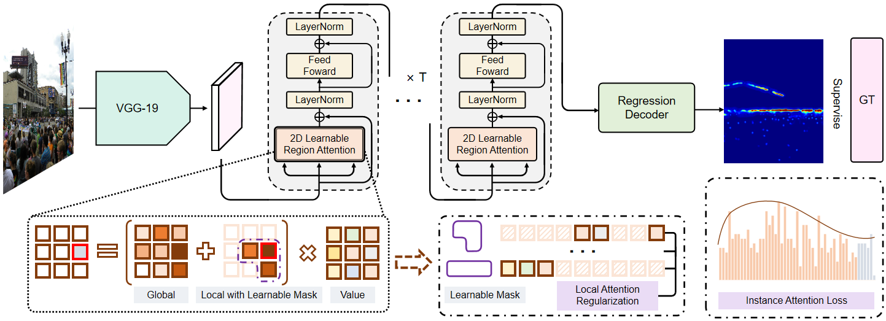

# COM S 5710 Fall 2024 Course Project Code (Group 7)
This code is based on the official implement [Link](https://github.com/LoraLinH/Boosting-Crowd-Counting-via-Multifaceted-Attention) of CVPR 2022 paper 'Boosting Crowd Counting via Multifaceted Attention'

# Team members

Saiful Islam, Ying Wei, Shahrzad Esmat, Rohail Alam

## Train
1. Dowload Dataset and save them into IDCIAv2. The images are placed in images folder and ground truth csv files are placed in ground_truth folder.
2. Preprocess them by 'python preprocess_dataset_cell.py'.
3. Change the path to where your data and models are located in 'Train.py'.
4. Run 'Train.py'
5. Wait patiently and happily for the program to finish.
6. Then you will get a good counting model!

## Test
1. Dowload Dataset and save the images in folder IDCIAv2/test_imgs.
2. Preprocess them by 'python preprocess_dataset_cell.py --split=test'.
3. Change the path to where your data and models are located in 'Test.py'.
4. Run 'Test.py'.
5. It will generate a 'submission.csv' file in this folder.
